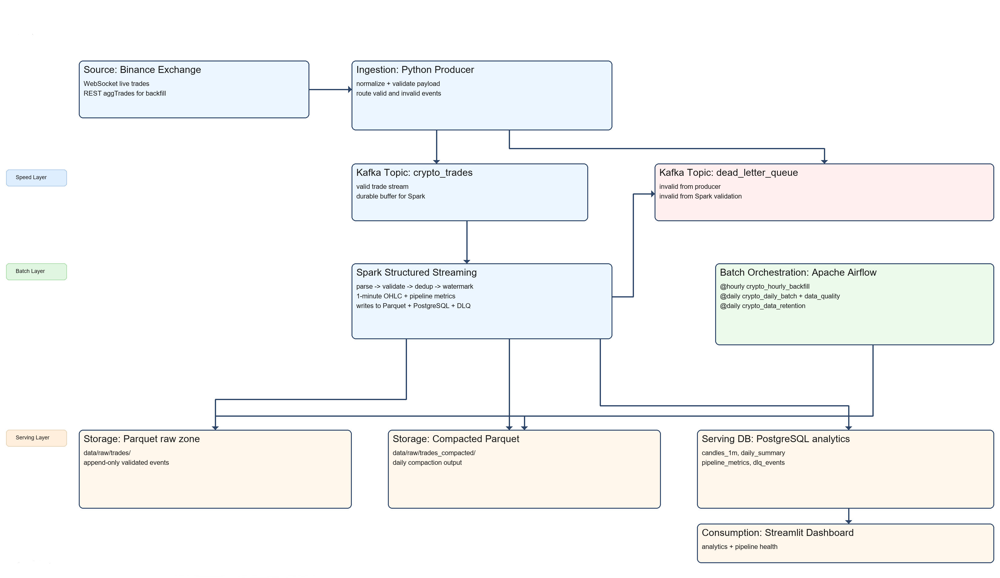
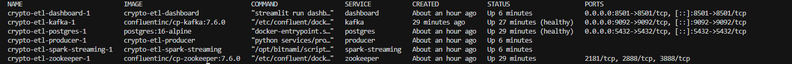
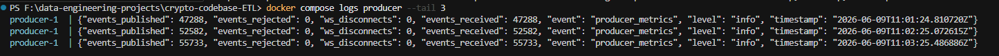
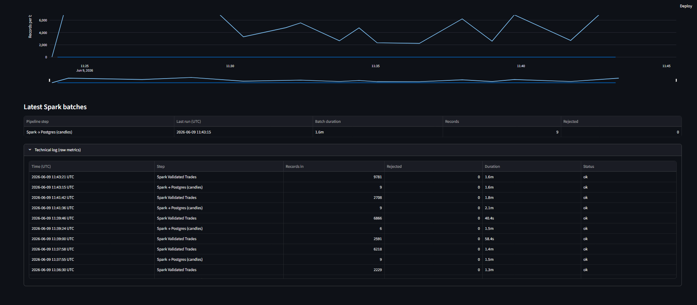
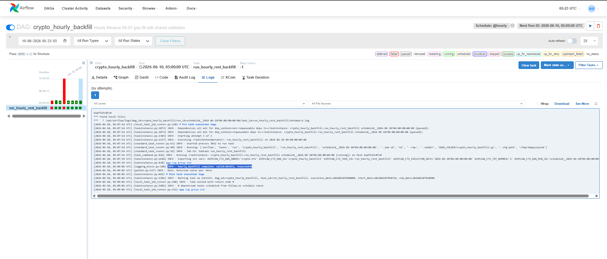
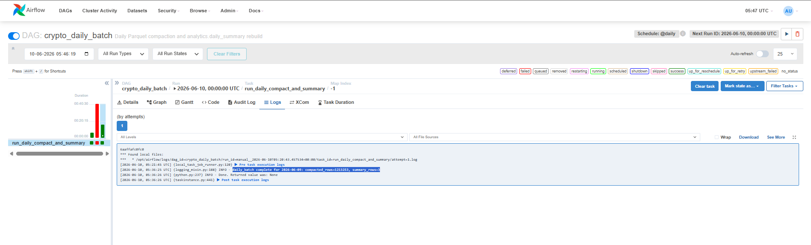
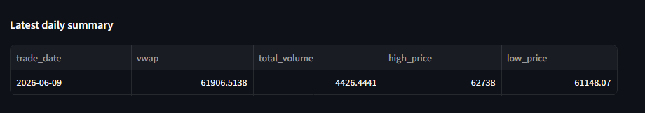
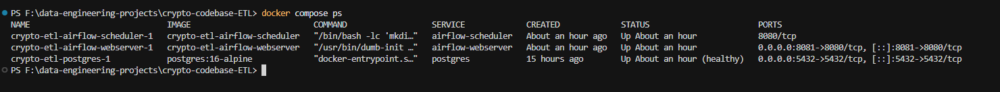
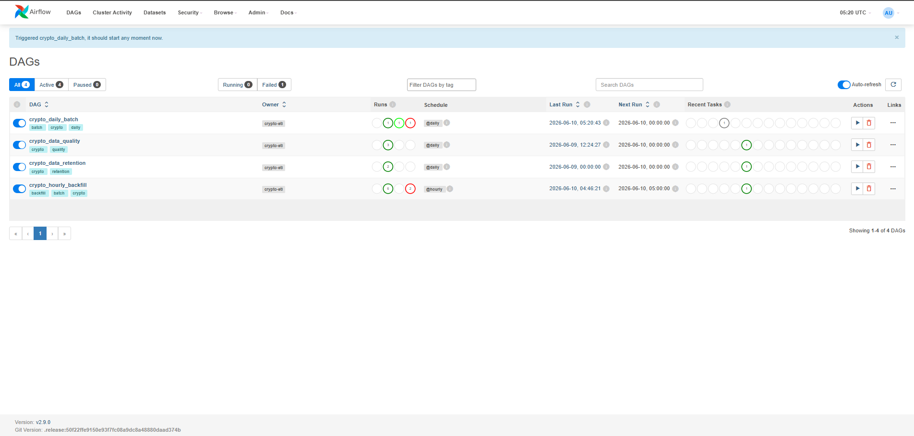

# Real-Time Crypto Analytics Pipeline
### Streaming · Batch Orchestration · Operational Observability

A production-grade hybrid data platform for cryptocurrency analytics — combining real-time WebSocket ingestion, Kafka-backed streaming, PySpark processing, and Airflow-orchestrated batch workflows into a single end-to-end system.

---

## Table of Contents

- [Architecture Overview](#architecture-overview)
- [Tech Stack](#tech-stack)
- [Key Engineering Decisions](#key-engineering-decisions)
- [Streaming Pipeline](#streaming-pipeline)
- [Batch Orchestration](#batch-orchestration)
- [Data Quality](#data-quality)
- [Observability](#observability)
- [Project Structure](#project-structure)
- [How to Run](#how-to-run)

---

## Architecture Overview

```
Binance WebSocket
       │
       ▼
  Kafka Producer
  (async Python)
       │
       ▼
  Kafka Topic
  (raw trades)
       │
       ├──────────────────────────┐
       ▼                          ▼
PySpark Structured           Kafka DLQ
   Streaming                (invalid records)
       │
       ├─────────────────────────────────┐
       ▼                                 ▼
PostgreSQL (OHLC candles)       Parquet Archive
(idempotent upserts)            (partitioned by
                                 year/month/day/hour)
       │
       ▼
  Streamlit Dashboard
  (sub-30s latency)
       │
       ▼
  Airflow DAGs
  (backfill · compaction · quality · retention)
```

---

## Tech Stack

| Layer | Technology |
|---|---|
| Ingestion | Binance WebSocket API · async Python |
| Message Queue | Apache Kafka · Zookeeper |
| Stream Processing | PySpark Structured Streaming |
| Batch Orchestration | Apache Airflow |
| Storage | PostgreSQL · Parquet (partitioned) |
| Data Quality | Pydantic · Kafka DLQ · Airflow gate |
| Serving | Streamlit |
| Infrastructure | Docker Compose (11 services) |

---

## Key Engineering Decisions

### 1. Three-Sink Spark Topology with Independent Checkpoints
Each output sink — raw Parquet archive, PostgreSQL OHLC upserts, and Kafka dead-letter queue — runs with its own independent checkpoint. This means a failure in one sink does not trigger a full pipeline restart. Recovery is isolated per sink, reducing downtime and replay cost.

### 2. Shared Validation Contract
A single Pydantic + DataFrame validation schema is enforced at three stages: ingestion, streaming, and batch. This eliminates producer-consumer schema drift — if a record fails validation at any stage, it is routed to the Kafka DLQ for audit rather than silently corrupting downstream tables.

### 3. Idempotent PostgreSQL Writes
All candle upserts use `ON CONFLICT DO UPDATE` semantics. Spark can safely replay a batch without producing duplicate records — critical for exactly-once correctness in a streaming system without a transactional sink.

### 4. Watermarking and Event-Time Windowing
Spark Structured Streaming uses event-time windowed aggregation with watermarking to handle late-arriving trades and compute accurate 1-minute OHLC candles. This prevents stale or out-of-order records from corrupting window results.

### 5. Partitioned Parquet Storage
Raw trades are partitioned by `year/month/day/hour`. This layout supports both streaming append (new hourly partitions) and batch compaction (coalescing small files within a partition) without path conflicts.

---

## Streaming Pipeline

The streaming stack is containerised across 6 services: Kafka, Zookeeper, Spark, Producer, PostgreSQL, and Streamlit.

### Figure 1 — Streaming Stack: All Services Running


> Verify service names and Up/healthy states before evaluating data flow.

---

### Figure 2 — Producer Runtime Metrics (Live Ingestion Proof)


> Rising `events_published` with `events_rejected=0` and `ws_disconnects=0` confirms stable WebSocket ingestion quality.

---

### Figure 3 — Analytics Dashboard (BTCUSDT 1-Minute Market View)


> Streamlit dashboard served from PostgreSQL-backed OHLC tables. Symbol selector and refresh timestamp confirm live data flow.

---

### Figure 4 — Pipeline Health KPIs (Streaming Operations)


> Top-level operational readiness view. `status=Healthy` with low error rate confirms end-to-end streaming integrity.

---

### Figure 5 — Spark Batch Metrics (Per-Step Breakdown)


> Per-batch throughput, duration, and reject counts exposed for SLA analysis and troubleshooting.

---

## Batch Orchestration

Four Airflow DAGs handle everything the streaming layer cannot: gap-filling from REST, file compaction, business metric generation, and data retention.

| DAG | Schedule | Purpose |
|---|---|---|
| `crypto_hourly_backfill` | Hourly | REST API gap-fill for WebSocket disconnects |
| `crypto_daily_batch` | Daily | Parquet compaction + VWAP/high-low summary |
| `crypto_data_quality` | Daily | DLQ ratio gate — fails if rejection > 5% |
| `crypto_data_retention` | Daily | Cleanup of expired raw data |

### Figure 6 — Airflow Stack Running


> Prerequisite for all DAG execution. Scheduler and webserver must both be healthy.

---

### Figure 7 — Airflow DAG Catalog and Schedules


> All four DAGs registered with correct schedules and recent run history confirming active orchestration.

---

### Figure 8 — Hourly Backfill DAG Execution Log


> Confirms REST gap-fill execution and Airflow success state transition for the backfill task.

---

### Figure 9 — Daily Batch DAG Execution Log


> Validates scheduled Parquet compaction and daily VWAP/high-low summary generation.

---

## Data Quality

### Figure 10 — Data Quality DAG Gate Result


> Automated quality checkpoint. Logs `records_in`, `records_dlq`, `dlq_ratio`. DAG fails the run if rejection rate exceeds 5%, preventing silent data corruption from reaching downstream tables.

---

### Figure 11 — Daily Summary Business Output


> Business-facing artifact produced by the daily batch DAG. Finalized VWAP, volume, high, and low metrics ready for consumption.

---

## Observability

### Figure 12 — Unified Health View (Streaming + Batch)


> Single dashboard panel tracking both streaming and batch pipeline health. Confirms end-to-end observability without external monitoring infrastructure.

---

## Project Structure

```
crypto-analytics/
├── producer/               # Async WebSocket → Kafka ingestion
├── spark/                  # PySpark Structured Streaming jobs
├── airflow/
│   └── dags/               # 4 orchestration DAGs
├── dashboard/              # Streamlit app
├── postgres/               # Schema and init scripts
├── docs/
│   └── screenshots/        # All 12 figures (drop images here)
├── docker-compose.yml      # 11-service stack
└── README.md
```

---

## How to Run

> **Note:** This project is designed to run locally via Docker Compose. All 11 services are defined in a single `docker-compose.yml`.  
> For full setup, Makefile targets, and troubleshooting, see [SETUP_AND_OPERATIONS.md](SETUP_AND_OPERATIONS.md).

```bash
# Clone the repo
git clone https://github.com/TanishChauhan/<repo-name>.git
cd <repo-name>

# Start the full stack
docker compose up -d

# Verify all services are healthy
docker compose ps

# Access the dashboard
open http://localhost:8501

# Access Airflow
open http://localhost:8080
```

---

## About

Built as an end-to-end portfolio project to demonstrate full ownership of a production-style data engineering system — from raw WebSocket ingestion to business-ready analytics and operational observability.

**Author:** Tanish Chauhan · [LinkedIn](https://www.linkedin.com/in/tanish-chauhan-5a645a190) · [GitHub](https://github.com/TanishChauhan)
